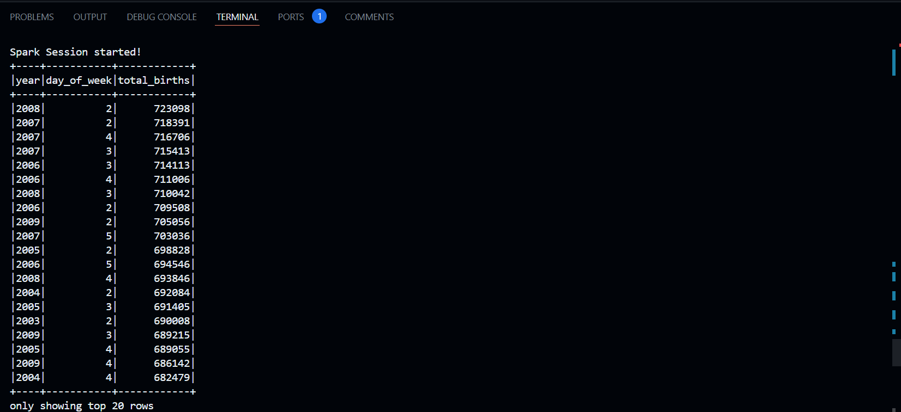

# mts79-pyspark-week10
[](https://github.com/nogibjj/mts79-pyspark-week10/actions/workflows/cicd.yml)

## Births Data Analysis with PySpark

This repository contains materials and code for processing and analyzing births data using PySpark. The project focuses on data transformation, analysis, and query execution on a dataset of births, and applies advanced techniques for data manipulation and analysis using Spark.

## Table of Contents
- [Overview](#overview)
- [Project Structure](#project-structure)
- [Setup Instructions](#setup-instructions)
- [Usage](#usage)
- [Features](#features)
- [Running Tests](#running-tests)
- [Related Images](#related-images)

## Overview

This repository is designed for processing and analyzing a dataset of births using PySpark. The dataset includes columns such as year, month, day of the month, day of the week, and the number of births on that day. The goal of the project is to perform various transformations, run analytical queries, and generate insights from the data using PySpark.

The repository contains Python scripts for data processing, loading datasets, and performing analysis using PySpark. It can be run locally or in a GitHub workspace environment.

## Project Structure

The repository contains the following files and folders:

- `data/`: Contains the dataset (`births.csv`) used in the project.
- `mylib/`: Python scripts for data processing, loading, and querying.
- `main.py`: The main entry point to run the PySpark analysis and transformations.
- `Makefile`: Includes commands for setup, testing, linting, and formatting.

## Setup Instructions

To set up this project locally, follow these steps:

1. **Clone the repository:**

    ```bash
    git clone https://github.com/nogibjj/mts79-pyspark-week10
    cd mts79-pyspark-week10
    ```

2. **Install dependencies:**

    Ensure you have Python 3.8+ installed, then install the required packages:

    ```bash
    make install
    ```

3. **Install Spark:**

    If you haven't already installed Apache Spark, follow the instructions [here](https://spark.apache.org/downloads.html) to set up Spark on your machine.

4. **Ensure all dependencies are installed** by running:

    ```bash
    make install
    ```

## Usage

To start working with the scripts, follow these guidelines:

1. **Run the main script:**

    The main entry point for this project is the `main.py` script, which will load the data, perform transformations, and display results:

    ```bash
    python main.py
    ```

2. **Run specific operations:**

    You can edit and modify `main.py` to perform different analyses or queries as needed.

## Features

- **Data transformation:** The project includes functions to transform the raw dataset, such as adding calculated columns and formatting data.
- **Query execution:** Perform SQL-like queries on the dataset using Spark SQL.
- **Data analysis:** Generate descriptive statistics and summarize key features of the dataset.

## Running Tests

To run the tests for the project, use the following command:

```bash
make tests
```

## Related Images


.png>)